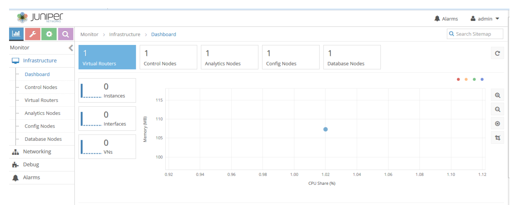

**Contrail**

Contrail est un contrôleur SDN développé par la société JUNIPER. 

C’est une solution qui offre une version [open source](https://tungsten.io/) et une version [payante](https://www.juniper.net/us/en/products-services/sdn/contrail/). 

Avec Contrail nous pouvons automatiser et orchestrer la création de réseaux virtuels hautement évolutifs.

Il permet de créer des réseaux virtuels qui s'intègrent en toute transparence aux réseaux physiques existants et qui sont simples à gérer et à orchestrer. 

Cela évite la dépendance vis-à-vis d'un seul fournisseur et élimine les coûts qui y sont liés grâce à une architecture ouverte fonctionnant conjointement avec une large gamme de systèmes d'orchestration et de réseaux physiques.

Voici ci-dessous l’interface graphique de Contrail.

**Architecture de contrail**

Contrail dispose d'une architecture modulaire.

Voici les différents composants de contrail :

- Configuration node

> The configuration node provides a REST API that allows an orchestration system to define virtual-networks, virtual-interfaces and network policies that control the flow of traffic between virtual-networks. 

- Control node

> The control node implements a distributed database that contains the ephemeral state of the system. Control nodes federate with each other using the BGP routing protocol. 

- Analytics engine

> The network analytics engine collects information such as network flow records from the compute-nodes and makes them available via a REST API. 

- Compute node

> The compute node includes both a user space process (agent) as well as dataplane component that executes as a loadable kernel module on the Host operating system.
