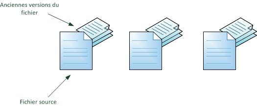
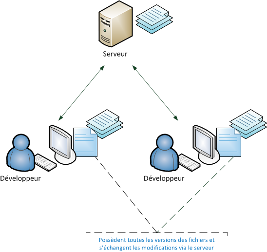
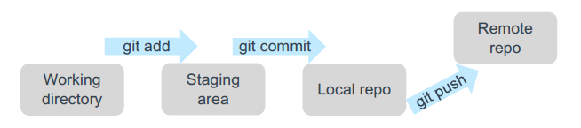
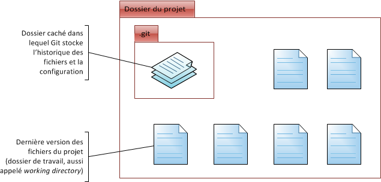

#### **Git**

Git à été conçue par le créateur du systeme d'exploitation Linux (Linus Torvalds).

C'est un système de gestion de version qui permet de gérer les codes sources et de suivre l’évolution des fichiers.

Il existe d'autre systeme de gestion de version comme le SVN.

Nous pouvons l'utiliser pour stocker :

- le code directement déployable (code python, script linux, etc)
- les fichiers de configuration Terraform, cookbooks Chef, playbooks Ansible, etc.




**Installation de Git**


- [https://git-scm.com/downloads](https://git-scm.com/downloads)

- [https://git-scm.com/book/fr/v2](https://git-scm.com/book/fr/v2)


**Fonctionnement de Git**

Le schéma ci dessous illustre le fonctionnement de Git.



Pour interagir avec le serveur Git, on utilise soit l'interface de ligne de commande ou des clients Git comme par exemple [Gitkraken](https://www.gitkraken.com/)

La plupart des IDE propose un client git intégré.

Quelques commandes git :



```sh

# Cette commande permet d'initialiser un nouveau projet dans le dossier courant

$ git init

# Cette commande permet d'ajouter les nouvelles modifications. On indique explicitement à git de prendre en compte les nouvelles modifications.

$ git add

# Cette commande permet de valider localement les modifications (local repository)

$ git commit

# Cette commande permet de publier les modifications sur le serveur distant (remote repository)

$ git push

# Cette commande permet de récupérer pour la premiere fois un projet déja existant sur le serveur distant

$ git clone <url>

# Cette commande permet de supprimer un fichier localement et sur le serveur distant 

$ git rm file.txt
$ git commit -m "removed file.txt"


# Cette commande permet de supprimer un fichier uniquemement localement 

$ git rm --cached file.txt

```




#### **GitLab**


**Gitlab** est un service de repository de code qui permet de mettre en place un serveur git.

Le logiciel permet de suivre les versions des fichiers et code sources et fournit plusieurs autres fonctionnalités :

* Suivi de ticket (Gitlab issues)

* Auto Devops (Gitlab CI)