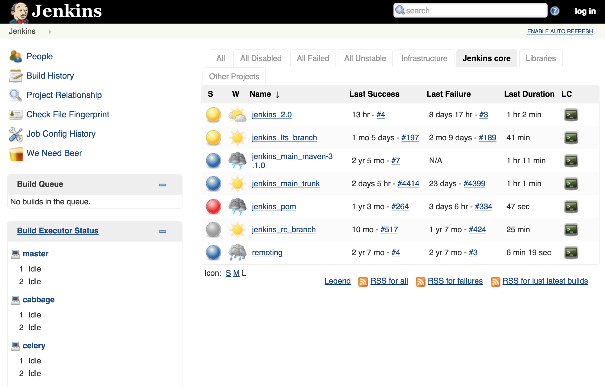
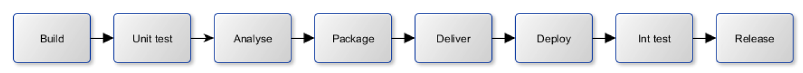

**Jenkins**

Le logiciel Jenkins permet d'orchestrer les différentes étapes de la chaine d'intégration et de déploiement.

Il permet d'automatiser la phase entre la récupération du code des développeurs sur l’outil de contrôle de version (GIT) et son déploiement sur l’infrastructure cible.

Comme illustré par le schéma ci dessus, Jenkins s’interface facilement avec les outils de la CI/CD.

Jenkins nous permet de définir les étapes de l’intégration et du déploiement de différente manière. 

Nous pouvons définir les étapes en utilisant l’interface graphique 



ou en utilisant le langage de programmation Groovy.

[https://jenkins.io/doc/book/pipeline/syntax/](https://jenkins.io/doc/book/pipeline/syntax/)

```groovy

pipeline {
    agent any
    stages {
        stage('Example') {
            steps {
                echo 'Hello World'
            }
        }
    }
    post { 
        always { 
            echo 'I will always say Hello again!'
        }
    }
}

```

Les projets Jenkins permettent de décrire les étapes de la chaine de déploiement.

Voici ci-dessous un exemple des étapes de déploiement continu.




**Apprendre JENKINS**

- [DOCUMENTATION](https://jenkins.io/doc/)
