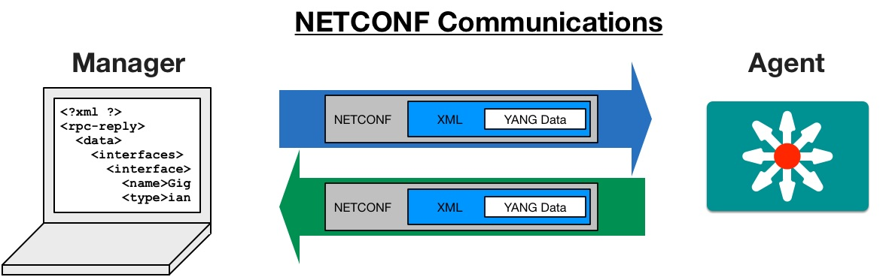

**YANG**

YANG  is a data modeling language for NETCONF described in the following RFC

* [RFC 7950](https://tools.ietf.org/html/rfc7950)

Repositories of YANG Models

* [IETF YANG MODELS](https://github.com/YangModels)
* [OPENCONFIG YANG MODELS](https://github.com/openconfig/public)

YANG Tools

* [pyang](https://github.com/mbj4668/pyang)
* [pyangbind](https://github.com/robshakir/pyangbind)
* [yang-explorer](https://github.com/CiscoDevNet/yang-explorer)

**NETCONF**

The NETCONF protocol is described in the following RFC :

- [RFC6241](https://tools.ietf.org/html/rfc6241)

NETCONF Tools

- [ydk-py](https://github.com/CiscoDevNet/ydk-py)
- [ncclient](https://github.com/ncclient/ncclient)

NETCONF protocol relies on YANG models which describe the device using well defined interfaces :

NETCONF protocol uses the RPC(Remote Procedure Call) for communications (SSH communications with XML data echange)

The NETCONF servers have differents datastore to manage configurational and operational data of the device.

Below is the list of NETCONF operations

The `<edit-config>` leaf can have an optional **operation** attribute.
By default the operation value is set to merge.

Below is the list of supported values for the **operation** attribue :

- **merge**

> The configuration data identified by the element
containing this attribute is merged with the configuration
at the corresponding level in the configuration datastore
identified by the `<target>` parameter.  This is the default
behavior.

- **replace**

> The configuration data identified by the element
containing this attribute replaces any related configuration
in the configuration datastore identified by the `<target>`
parameter.  If no such configuration data exists in the
configuration datastore, it is created.  Unlike a
`<copy-config>` operation, which replaces the entire target
configuration, only the configuration actually present in
the `<config>` parameter is affected.

- **create**

> The configuration data identified by the element
containing this attribute is added to the configuration if
and only if the configuration data does not already exist in
the configuration datastore.  If the configuration data
exists, an `<rpc-error>` element is returned with an
`<error-tag>` value of "data-exists".

- **delete**

> The configuration data identified by the element
containing this attribute is deleted from the configuration
if and only if the configuration data currently exists in
the configuration datastore.  If the configuration data does
not exist, an `<rpc-error>` element is returned with an
`<error-tag>` value of "data-missing".

- **remove**

> The configuration data identified by the element
containing this attribute is deleted from the configuration
if the configuration data currently exists in the
configuration datastore.  If the configuration data does not
exist, the "remove" operation is silently ignored by the
server.

