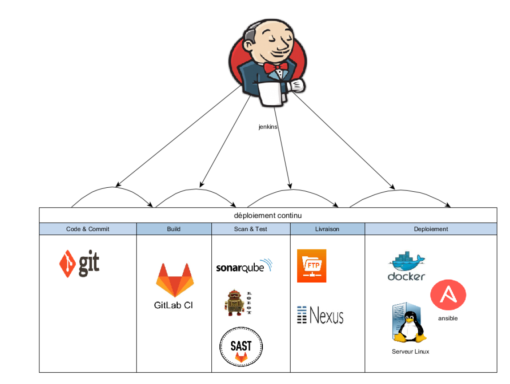

##### Les différentes approches 

Il existe plusieurs approches à l'automatisation du réseau.

La premiere approche est l'utilisation des technologies SDN & NFV pour concevoir des réseaux flexibles et facile à automatiser.
Cette approche demande un grand changement dans l'architecture réseau existant.
Les technologies SDN & NFV permettent de construire des réseaux *programmables* et simple à automatiser avec les interfaces nord du SDN Controller. Cette approche demande de revoir l'architecture du réseau et introduit de nouveaux composants dans le réseau de l'entreprise. 

La deuxieme approche est le maintien de l'architecture existant avec la mise en place de solutions logicielles pour centraliser la gestion du réseau.

Il existe plusieurs niveaux pour automatiser le réseau.

**Ad-hoc scripting**

Le premier niveau est l'utilisation des langages de programmation pour interagir avec les équipements. 

Il existe des modules spécifiques dans chaque langage de programmation et le langage de programmation le plus utilisé pour automatiser la gestion des équipements réseaux est le Python.

| Langages de programmation | Modules d'automatisation réseau |
| :-------:| :---------: |
| Python | netmiko   paramiko   pexpect   napalm   ncclient |
| Perl | Mnet   expect |

Généralement, ces modules permettent de se connecter en SSH ou Telnet sur les équipements pour éxécuter des instructions.

Elles fournissent une abstraction dans le langage (abstraction de bas niveau) pour interagir avec les équipements réseaux.

**Frameworks**

Une autre technique est l'utilisation des *frameworks* qui fournissent une couche d'abstraction supplémentaire (abstraction de niveau intermédaire) pour interagir avec les équipements réseaux.

Voici une liste non exhaustive des frameworks d'automatisation réseaux sur le marché  :

- [Ansible](https://docs.ansible.com/)
- [Stackstorm](https://docs.stackstorm.com/)

L'objectif est de fournir une abstraction de haut niveau pour interagir avec les équipements réseaux (LAN, WAN, Réseaux Cloud).

Il existe de nombreuses solutions propriétaires pour automatiser le réseau mais l'entreprise peut mettre en place sa propre solution en utilisant les technologies open source.

Ces solutions logicielles sont généralement multi-vendeurs et proposent les fonctionnalités suivantes :

- Découverte des équipements du réseau

- Représentation graphique de la topologie logique et physique du réseau

- Gestion et automatisation de la configuration des équipements

- Analyse du réseau pour détection des anomalies

##### **Culture d'automatisation**

L'automatisation du réseau demande une étroite collaboration entre les ingénieurs logiciels et ingénieurs réseaux. Les méthodes agiles et le mouvement DevOps permettent de réduire le risque d'échec d'un projet d'automatisation du réseau.

L'entreprise qui conçoit sa solution d'automatisation doit développé et intégré des composants de plusieurs vendeurs.

Les méthodes de travail classique (Cycle V) ne sont pas adaptés et la bonne réussite d'un projet d'automatisation du réseau nécessite un changement dans la maniere de travailler des équipes.

***Méthodes agiles***

L’agilité n’invente rien, mais remet au premier plan les bons principes et les bonnes pratiques qui produisent de bons résultats. 

Les approches agiles existent bien avant les années 2000 mais elles connaissent une plus grande visibilité à partir de 2001 avec le manifeste agile. 

17 experts en développement logiciel ayant une volonté de mettre en avant ce qui fonctionne bien et de fédérer des acteurs autour de valeurs et principes de travail.

Le manifeste introduit 4 valeurs et 12 principes de base dans une équipe agile.

On distingue principalement deux méthodes agiles : 

* la méthode agile *KANBAN*
* et la méthode agile *SCRUM*. 

Ces deux méthodes visent une amélioration empirique et continue de l’équipe. 

Elles permettent d’avoir un fonctionnement itératif contrairement à la méthode de gestion de projet en cycle V qui planifie tout à l’avance. 

Les méthodes agiles KANBAN et SCRUM permettent un management visuel du projet et favorisent des petites équipes qui produisent des petits livrables de manière continue.

La méthode agile KANBAN permet principalement de faire un management visuel des activités de chaque membre de l’équipe. 

L’idée est de suivre les actions des différents membres sous forme de taches. 

Une tache peut être dans les trois états suivants : « à faire », « en cours » et « terminée ».

La méthode agile SCRUM est très normative et identifie des rôles dans l’équipe. 

Cette méthode définit des « SPRINT » c’est-à-dire que l’équipe définie des périodes (idéalement des Sprint de 2 à 4 semaines) pour la livraison de petites fonctionnalités.

On distingue trois principaux acteurs dans une équipe Agile *SCRUM* :

| Acteur| Role |
| :-------:| :---------: |
| Le Product Owner (PO) | il porte la vision, valide et coordonne les actions. Il est responsable du retour sur investissement. Il affine le besoin avec l’équipe projet. Parmi ces qualités on retrouve la disponibilité, la compétence et l’investissement. |
| Le SCRUM Master |  c’est un facilitateur. Il organise les cérémonies (réunions des équipes). C’est le protecteur de l'équipe. Il connait l'organisation, l'agilité et garanti le bon fonctionnement du projet. Il permet la bonne communication avec les équipes et le P.O. |
| L' Equipe projet | L’équipe de réalisation est pluridisciplinaire, polyvalente et compétente dans plusieurs domaines. Une équipe agile est avant tout force de motivation. |

Il existe plusieurs outils pour la gestion de projet agile. 

| Logiciel | Méthode agiles |
| :-------:| :---------: |
| **JIRA** | SCRUM, KANBAN |
| WEKAN | KANBAN |
| TRELLO | KANBAN |
| LEANKIT | KANBAN |

***DevOps***

Le cycle de développement logiciel dans les grandes entreprises pose très souvent des problèmes d’alignement des équipes.

Les préconisations du mouvement DevOps permettent de fluidifier le cycle de développement logiciel (chaine de production) de l’entreprise et d’éliminer le plus possible les risques d’échec du projet.

L'idée du DevOps est d'aligner les équipes de développement et opérationnelles sur les memes objectifs. Il s'agit de construire des équipes projets et éviter le conflit d'interet entre les développeurs et les opérationnelles.

Ci-dessous les principales préconisations du mouvement DevOps :

* Communication et collaboration
* Intégration continue et déploiement continu
* Monitoring et mesures

Le schéma ci-dessous illustre la démarche DevOps :

La démarche DevOps s’intègre dans la continuité des méthodologies agiles.
Néanmoins la réussite d’un projet DevOps nécessite la mise en place d’outils pour aider les équipes. Ces outils permettent à l’entreprise de réduire considérablement le temps de mise en service du produit aux clients finaux.

Il existe sur le marché plusieurs solutions pour mettre en place une démarche DevOps dans une entreprise. L'objectif est de mettre en place une chaine d’outils pour faire de l’intégration et du déploiement continu.

Ci dessous une chaine d'outils pour faire de **l'intégration et du déploimenent continu** :

Ci dessous une liste d'outils pour les préconisations concernant la **communication, la collaboration, le monitoring et mesures** :

On parle aussi de  :

* NetOps (Equipes réseaux alignés avec les équipes Opérationnels)
* SecOps (Equipes sécurité alignés avec les équipes Opérationnels)
* DevSecOps (Equipes de Dev alignés avec les équipes Sécurité et Opérationnels)
