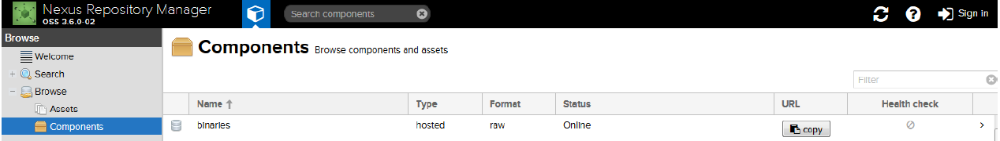

Nexus est un gestionnaire de référentiel qui supporte plusieurs langages de programmation. 

Voici le [lien](https://help.sonatype.com/display/NXRM3) vers la documentation officielle du logiciel.

Nous utilisons Nexus pour stocker essentiellement les référentiels python, docker, ruby, .... 

L’avantage de cette solution est qu’il nous permet de ne pas utiliser les référentiels publics et d’avoir le contrôle de ceux-ci. 

De même, il nous permet d’avoir un seul dépôt pour stocker les artefacts et nous pouvons les isoler par environnement.

Par exemple, nous pouvons avoir des artefacts uniquement accessible aux développeurs et des artefacts uniquement pour la production.

Le schéma ci-dessous illustre le principe de fonctionnement de Nexus :


Voici ci-dessous l’interface graphique de Nexus :



**JFrog Artifactory**

Le gestionnaire de référentiel concurrent à Nexus and JFrog Artifactory.

Voici ci-dessous l’interface graphique de JFrog Artifactory :


**Création de API KEY AND ENCRYPTED PASSWORD**

- [JFROG UI](https://www.jfrog.com/confluence/display/RTF/Updating+Your+Profile#UpdatingYourProfile-APIKey)


**Installer un module python en utilisant l'artifactory**

```sh

pip install -U flask-cors --index-url https://artifactory.si.mycompany.fr/api/pypi/pythonproxy/simple

```

**Installer un module nodejs en utilisant l'artifactory**

```sh

sudo npm install --global grunt --registry https://artifactory.si.mycompany.fr/api/npm/npmproxy/


```

**Installer un module bower en utilisant l'artifactory**


```sh

# Installer bower-resolver pour utiliser artifactory

npm install -g bower-art-resolver --registry https://artifactory.si.mycompany.fr/api/npm/npmproxy/

# Créer le fichier .bowerrc avec le contenu ci dessous

{
  "directory": "bower_components",
  "registry": "https://artifactory.si.mycompany.fr/api/npm/npmproxy/",
  "resolvers": [
    "bower-art-resolver"
  ]
}

bower install reveal.js

```