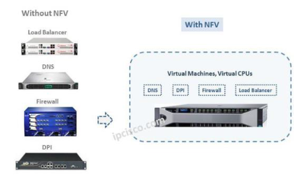

Avec le succès du cloud computing et les avantages qu’apportent la virtualisation, les entreprises cherchent à virtualiser le plus possible les fonctions réseaux pour réduire les coûts, réduire le nombre d’équipements dans le réseau et pour simplifier la gestion des équipements. 

On ne parlera plus de « routeur » ou « switch » mais de « virtual Router » ou « virtual Switch ». 

La technologie NFV (Network Functions Virtualization) permet donc de virtualiser les équipements réseaux.

On retrouve chez l’opérateur des serveurs sur lesquels fonctionnent plusieurs machines virtuelles pour héberger des services réseaux accessibles aux clients via internet ou des réseaux IP dédiés.

Les VNF (Virtual Network Functions) sont des fonctions réseaux virtualisés hébergés dans des machines virtuelles. On aura donc passage d'équipements (appliance) physiques à des équipements virtuelles et les performances des serveurs seront de plus en plus élevées.

Pour assurer l’intégrité des données, des mécanismes de redondance sont mis en place et des mesures sont prises pour assurer la sécurité des serveurs.

Le schéma ci-dessous illustre le passage d’équipements physiques à des équipements virtuels.

La virtualisation des réseaux connait un grand succés et elle permet aux opérateurs télécoms et cloud de construire des réseaux beaucoup plus flexible.

Elle offre de nombreux avantages aux opérateurs.

Les cas d'usage les plus répandue sur le marché sont :

| Use Case | Description |
| :-------:| :---------: |
| vCPE (virtual Customer Premise Equipment) | Les vCPE permettent de virtualiser les fonctionnalités du CPE sur un serveur |
| uCPE | uCPE pour universal CPE. L'idée est d'avoir un boitier multivendeur qui permet l'instanciation de plusieurs VNF   Notion de whitebox/Grey Box. |
| vIMS (virtual IP Multimédia System) | Le vIMS permet aux ISP de virtualiser les services de type voice-over-LTE et voice-over-IP |
| vRAN (virtual Radio Area Network) | Le vRAN permet aux ISP de virtualiser leur réseau mobile qui utilise les ondes radio (Ex : 5G) |
| vEPC (virtual Virtual Evolved Packet Core) | Le vEPC permet aux ISP de virtualiser le coeur de leur réseau mobile |

L'organisme de standardisation ETSI (European Telecommunications Standard Institute) à mis en place une architecture de référence pour le NFV.

[ETSI NFV Reference Architecture](https://www.etsi.org/technologies-clusters/technologies/nfv).

| Composant | Description | Solutions logicielles |
| :-------:| :---------: | :--------------------: |
| **VNF** : Virtual Network Functions | Les VNF sont des fonctions réseaux virtualisés. Il s'agit de machines virtuelles ou des containers qui fournissent des fonctionnalités réseaux. | VNF Fortinet   ISRv |
| **VIM** : Virtual Infrastucture Manager |  Le Virtual Infrastructure Manager (VIM) fournit une abstraction pour gérer le NFVI. Le NFVI est l'infrastructure qui permet de gérer les puissances de calcul, de stockage et l'interconnection réseau entre les machines virtuelles. Le NFVI utilise les technologies de virtualisation sur le marché (Hyperviseurs) |  **Openstack**   Kubernetes   vSphere |
| **NFVO** : Network Functions Virtualization Orchestrator |  Le NFVO fournit une couche d'abstraction pour gérer les services réseaux. Le NFVO gere le catalogue des resources (Resources Catalog), les instances des services (Service Instance), et l'interconnection entre les services (Service Chaining). Il permet de gérer le cycle de vie des services réseaux.  L'ingénieur réseau définit le service réseau en utilisant les langages de modélisation YANG ou TOSCA et l'orchestrateur se charge d'éffectuer les configurations sur les équipements réseaux (physiques ou virtuelles) | Blueplanet   NSO   ONAP |

L'ETSI a initié un projet, Open Source MANO, pour mettre en place les différents composants de cette architecture de référence. Pour avoir plus d'information sur le projet OSM, consultez le [site de référence](https://osm.etsi.org/wikipub/index.php/Main_Page) du projet.

Une alternative au projet Open Source MANO de l'ETSI est le projet ONAP(Open Network Automation Platform) du Linux Foundation.

Dans le cadre de l'architecture de référence ETSI NFV, ONAP peut etre considéré comme un projet MANO++. Les interfaces définit dans ONAP sont compatibles avec le standard ETSI NFV mais l'architecture d'ONAP permet de faire évoluer le produit pour répondre à des besoins spécifique des entreprises.

Le projet ONAP connait un grand succés dans les entreprises Télécom et actuellement le programme On Demand Networks du groupe Orange évalue la solution logicielle ONAP avec plusieurs cas d'usage (vCPE, vRAN, vPEC, ...).

Le Software Defined Network (SDN) associé à la Network Functions Virtualization (NFV) correspond à une évolution majeure dans l’univers des réseaux.

**Orange Business Services** propose actuellement son offre **Easy Go Network** qui s'appuie sur les technologies SDN et NFV.

L'offre prévoie la livraison d'un uCPE Self Install chez le client et des Points de présence (POP) permettent de faire le lien entre le réseau SDN et le réseau existant.

On retrouve dans les POP, Openstack pour la gestion de l'infrastructure virtuelle (création de VM, VNF,...) et Contrail pour la gestion du réseau (liens réseaux, tunnel VPN, ...).

