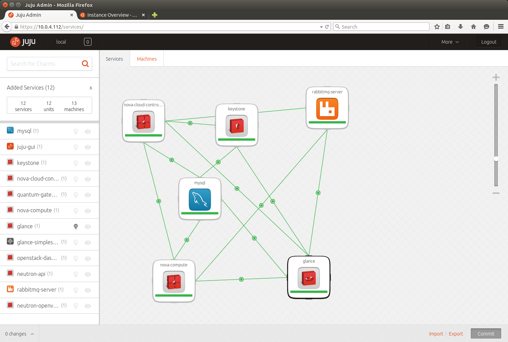

Openstack est un ensemble de logiciels open source permettant de déployer des infrastructures de cloud computing. 

C'est un gestionnaire d'infrastrcuture virtuelle ( VIM : Virtual Infrastructure Manager)

La technologie possède une architecture modulaire composée de plusieurs projets corrélés qui permettent de contrôler les différentes ressources des machines virtuelles telles que la puissance de calcul, le stockage ou encore le réseau inhérents au centre de données sollicité. 

* Neutron : module de gestion des réseaux
* Keystone : module de gestion de l'authentification et de l'autorisation 
* Nova : module de gestion des instances des machines virtuelles
* Heat : module d'orchestration
* Glance : module de gestion des images
* Horizon : interface graphique
* Cinder (Openstack) : block storage management

Le projet est porté par la Fondation Openstack, une organisation non-commerciale qui a pour but de promouvoir le projet Openstack ainsi que de protéger et d'aider les développeurs et toute la communauté Openstack. 

De nombreuses entreprises ont rejoint la fondation Openstack.

C'est un logiciel libre distribué selon les termes de la licence Apache.

Voici ci dessous l'interface graphique d'openstack (module Horizon écrit en Django).

