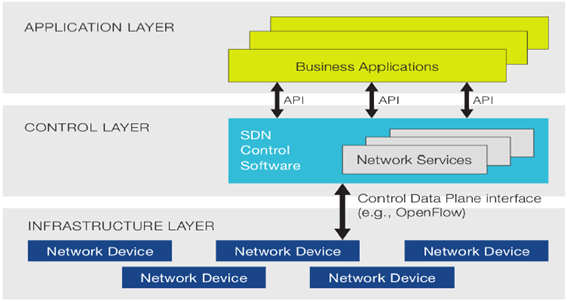
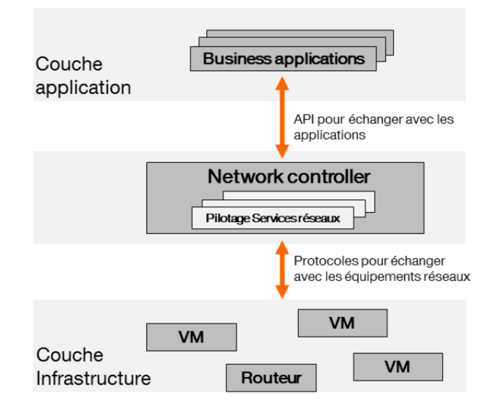

##### Les évolutions au niveau de l’architecture réseau des entreprises

 
Pour mettre en place les services internet (sites web, jeux en ligne, applications en ligne,…) nous utilisons les équipements réseaux (**routeurs**, **switch**, **serveurs**, …) pour faire fonctionner ces différents services. Avec l’explosion des données et des demandes de service, ces équipements réseaux évoluent pour faire face aux besoins des clients.

Les entreprises hébergent de plus en plus leurs données dans les **centres de donnés** (datacenter) et leurs réseaux sont gérés dans le Cloud pour leur permettre plus de flexibilité et d’économie. Il existe aujourd’hui de nombreux fournisseurs qui proposent aux entreprises d’héberger leurs données ou applications dans le Cloud. Les datacenters se multiplient donc et les réseaux des opérateurs télécoms évoluent aussi pour faire face aux demandes en bande passante (débit). 

Dans les centres de donnés on retrouve donc des environnements virtualisés basés sur des technologies diverses par exemple VMWare, KVM, …

Le principe du Cloud repose sur la **virtualisation** qui permet aux fournisseurs  d’optimiser et d’accroître considérablement le taux d’utilisation des ressources serveurs et postes de travail nécessaires aux entreprises. L’équation « une application = un serveur » est rendue obsolète car avec la virtualisation plusieurs applications peuvent tourner sur un même serveur. La gestion dynamique, et non plus statique, des ressources serveurs et applicatives permet de répondre aux besoins de plus en plus élevés de qualité de service rendue aux utilisateurs.

Chez les fournisseurs de Cloud, on retrouve donc des serveurs sur lesquels fonctionnent plusieurs **machines virtuels** qui vont hébergés des services accessibles aux clients via internet ou des réseaux IP dédiés. Pour assurer l’intégrité des données,  des mécanismes de redondance sont mis en place et des mesures sont prises pour assurer la sécurité des serveurs.

Plusieurs problématiques se posent donc dans la fourniture de ces types de service et les entreprises IT se force chaque jour de répondre à ceux-ci en apportant de nouvelles solutions sur le marché.

Parmi ces problématiques figurent donc la centralisation de la gestion des équipements et l’automatisation des services réseaux. Il existe sur le marché plusieurs équipementiers (Cisco, Juniper, HP, Toshiba,…) qui proposent des solutions types à ces problématiques réseaux mais il n’existait pas avant 2013 un standard par rapport à la problématique de centralisation de la gestion du réseau.

Des études dans les laboratoires R&D ont permis de repenser la façon dont sont gérés les équipements réseaux et de proposer des solutions pour faciliter l’innovation dans ce domaine : il s’agit du SDN. 

Vu les avantages qu’apportent la virtualisation, les entreprises IT cherchent aussi à virtualiser le plus possible les fonctions réseaux pour d’une part avoir plus de souplesse dans l’architecture réseau mais aussi pour réduire ces équipements dans le Datacenter. On ne parlera plus de routeur ou switch mais de vrouter (virtual router) ou vswitch (virtual switch).

Mais virtualisés ces fonctions réseaux impliquent beaucoup de chose et c’est là tout l’intérêt du SDN. Nous verrons comment le SDN et le NFV fonctionnent et ses avantages pour les entreprises IT.

 

##### Comprendre le SDN/NFV

La notion de SDN est assez vaste et plusieurs approches de cette technologie existent. De façon générale le SDN est une nouvelle manière de penser le réseau. Cette nouvelle approche du réseau permettrait d’automatiser la gestion du réseau grâce à la programmation. La nouveauté est la séparation du plan de contrôle et du plan de donnée dans les équipements réseaux. Un contrôleur central  pilote l’ensemble des équipements. On définit les règles dans le contrôleur qui le transmet directement à tous les équipements. On va pourvoir piloter des équipements de différentes marques dans la mesure où ils respectent les standards définit par les organismes de normalisation (IETF, ONF, ...).

Le data plane est implémenté dans les équipements réseaux et le contrôle plane est implémenté dans les contrôleurs réseaux.

Une couche d’abstraction (abstraction layer) entre le plan de contrôle (applications IT) et le plan de donnée (équipements réseaux) est donc mise en place en utilisant des protocoles de communication comme Openflow, XMPP, BGP, …

Des **API** (Application Programming Interface) utilisées par les applications vont permettre de gérer le réseau avec des interfaces simple à utiliser. Les API sont des interfaces de programmation qui permettent de masquer toute la complexité de programmation aux utilisateurs. L’objectif est de fournir une porte d'accès à une fonctionnalité en cachant les détails de la mise en œuvre.

Le schéma suivant résume bien le principe du SDN :

Avec le SDN, on va donc être en mesure de piloter le réseau avec un composant central qui est le **contrôleur SDN** (SDN Network Controller).

De plus, pour gagner encore plus en flexibilité et dynamisme, les entreprises portent les fonctions réseaux des boitiers physiques (Appliance : routeurs, switch, firewall)  dans des environnements virtuels.

Les machines virtuelles sur les serveurs non seulement vont hébergées des applications métiers mais aussi des fonctions réseaux (firewall, antivirus, Deep Packet Inspection,…)

Le schéma suivant illustre bien le principe du NFV :

 
Les VNF (Virtual Network Functions) sont des fonctions réseaux virtualisés hébergés dans des machines virtuelles. 
On aura donc passage **d'appliances physiques** à des appliances virtuelles et les performances des serveurs seront de plus en plus élevées.
A l’aide donc d’APIs, les applications vont pourvoir dialoguer avec le réseau pour obtenir des informations sur l'état du réseau, créer des services, etc…

Le couplage du SDN et du NFV, aboutira donc à des infrastructures centralisées.
Le schéma suivant illustre bien ce principe :

