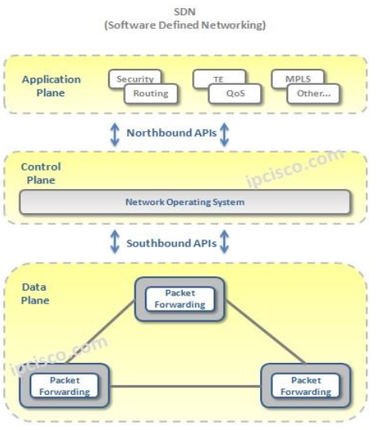

## Software Defined Network

Les technologies réseaux évoluent chaque jour et les opérateurs télécoms doivent faire face à ces nouvelles technologies.

Des études dans les laboratoires de recherche et développement ont permis de repenser la façon dont sont gérés les équipements réseaux et de proposer des solutions pour faciliter l’innovation dans ce domaine. 

L’une des solutions est le SDN « Software Defined Network ». 

Cette technologie réseau connait un grand succès depuis 2012 et permet une flexibilité du réseau des opérateurs télécoms.

L’intelligence des réseaux, initialement portée par chacun des équipements réseaux (commutateurs, routeurs, pare-feu,...), est désormais gérée de façon centralisée grâce à une plateforme logicielle.

Le pilotage du réseau de l’entreprise s’effectue en toute sécurité à l’aide d’un équipement qui est le **contrôleur SDN** qui permet la priorisation et le routage (aiguillage) des flux de données. 

Le contrôleur SDN est le noeud central qui pilote l’ensemble des équipements du réseau qu’il gère. La partie décisionnelle des équipements réseaux (plan de contrôle) est séparée de leur partie opérationnelle (plan de donnée, plan de management) et déportée vers un unique point de contrôle qui dirige l'ensemble de façon cohérente. 

Le schéma ci-dessous illustre le fonctionnement du contrôleur SDN.

Le role du controleur réseau est de fournir une abstraction (Northbound API) aux applications pour ajouter de nouvelles fonctionalités réseaux.
De meme, le controleur utilise plusieurs protocoles (Southbound API) pour interagir avec les équipements du réseau.

| *NOURTHBOUND API* | *SOUTHBOUND API* |
| :-------:| :--------------------: |
| REST API  NETCONF   RESTCONF   | NETCONF   RESTCONF   CLI (SSH/TELNET)   OPENFLOW   OPFLEX   P4   OVSDB   BGP |

Le controleur réseau peut à la fois interagir avec des équipements réseaux physiques et virtualisés.

On utilise le terme **SD-WAN : Software Defined WAN** quand la technologie SDN est appliqué à l'interconnection de plusieurs sites distant d'une entreprise (réseau **WAN**).

Ci dessous l'architecture de référence du SD WAN proposée par la [MEF](http://www.mef.net/).

|  Component  | Description  |
| :---------: | :---------:  | 
| SD-WAN Edge | équipement réseau physique ou virtuel |
| SD-WAN Gateway | permet une connectivité réseaux vers des services externes |
| SD-WAN Controller | permet une gestion centralisé des SD-WAN edges & gateways |
| Service Orchestrator |  Lifecycle Service Orchestration du SD-WAN et autre service |
| Subscriber Web Portal | Portail d'ordering et change request |

La technologie SD-WAN s'appuie sur la couche underlay MPLS ou Internet et les SD WAN gateways permettent un accés à des sites distants non SD-WAN.

Le SD-WAN Controller utilise la couche overlay (tunnel virtuel) pour gérer les SD-WAN edges.

**Orange Business Services** accompagne ses clients dans la mise en place de la technologie SD-WAN en s'appuyant sur la solution logicielle de Cisco Viptela. (Offre Flexible SDWAN)

La solution Viptela est déployé sur le réseau de l'opérateur et les SD-WAN gateways permettent une connection avec les sites non SD-WAN en utilisant l'offre Orange Business VPN.

Ci-dessous les composants de la solution Cisco Viptela.

|  Component  | Description  |
| :---------: | :---------:  | 
| *vEdge* | il s’agit des routeurs physiques ou virtualisés (ISR/ASR, vedge) |
| *vBond* | Les vBond sont connectés à chaque vEdge.   Il s’assure de la configuration initiale de l’équipement et informe le vManage des informations essentielles (adresse IP  de management, …) |
| *vSmart* | il joue le rôle de contrôleur SD-WAN. Il utilise un protocole overlay (Overlay Management Protocol) pour interagir avec les équipements du réseau.   Les vSmart sont connectés à chaque vEdge. |
| *vManage* | il s’agit du portail de management pour gérer le réseau (communications WAN).   Il fournit un portail pour gérer le réseau, définir les trafics, les politiques de sécurité, …   Il fournit aussi une interface nord (REST API, NETCONF) pour gérer le réseau. |