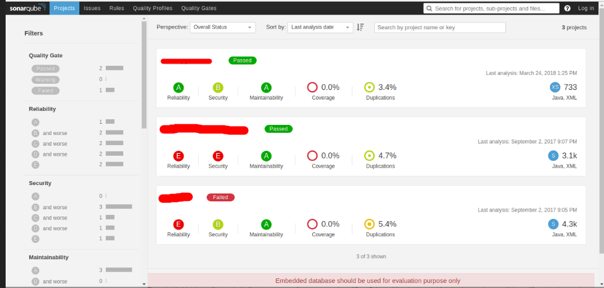

Dans un contexte de développement logiciel, il est primordial de mettre en place des solutions pour réduire la vulnérabilité du produit final.

Il existe sur le marché, plusieurs logiciels pour analyser la qualité et la sécurité du code des développeurs.

* [GitLab CodeQuality](https://gitlab.com/gitlab-org/security-products/codequality)

* [CodeClimate](https://docs.codeclimate.com/docs/list-of-engines)

* [SonarQube](https://www.sonarqube.org/)

Le logiciel SonarQube supporte plus de 20 langages de programmation (Python, JAVA, Groovy,…) et peut être facilement interfacé avec Jenkins.

Voici ci-dessous l’interface graphique de SonarQube.

L’analyse de la qualité permet d’identifier les problèmes dans le code des développeurs. 

SonarQube nous donne des indicateurs sur le code par exemple le nombre de lignes, les erreurs, la complexité et la dette technique. 

La dette technique permet à l’équipe d’estimer le temps nécessaire pour avoir un code de qualité.

Voici ci dessous quelques liens utiles

* [Documentation](https://www.sonarqube.org/)
* [Sonar Coverage](https://docs.sonarqube.org/display/PLUG/Python+Coverage+Results+Import)
* [Sonar Pylint](https://docs.sonarqube.org/display/PLUG/Pylint+Report)

Pour analyser localement le code on peut utiliser les outils suivants :

|  Language | Outils |
| :------ |  :------------ |
| Ansible  | ansible-lint    |
| Python   |  pylint   flake8 [mccabe, pycodestyle, pyflakes]   bandit|
| Java |  find-sec-bugs |
| Ruby | brakeman |
| Docker | [clair](https://github.com/coreos/clair) |
| C/C++ | Flawfinder |
| Scala | find-sec-bugs |
| PHP | phpcs-security-audit |
| .NET | [Security Code Scan](https://security-code-scan.github.io/) |
| Node.js | [NodeJsScan](https://github.com/ajinabraham/NodeJsScan) |
| Sécurité du code | Coverity   Fortify   CheckMark   GitLab SAST (Open source) |