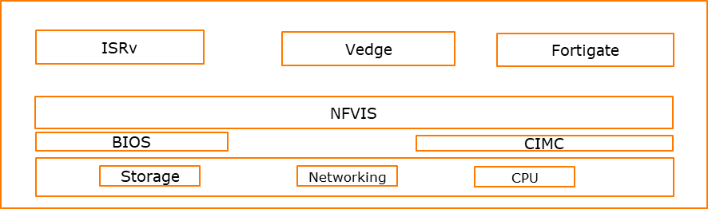
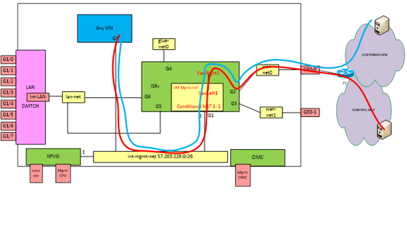

L'uCPE est un cas d’usage de la virtualisation des réseaux (NFV) chez les opérateurs télécoms. 

On retrouve sur chaque site client, des uCPE qui sont des nouvelles générations de CE qui permettent une flexibilité d’instanciation de nouveaux services sur le routeur client.

Il s’agit de boitier qui supporte la virtualisation des réseaux. 

On va pourvoir instancier plusieurs Virtual Network Functions (router, SD-WAN, VPN, NAT, DHCP, IPS/IDS, PBX, transcoders, WAN optimization) sur le boitier et grâce aux Service Chaining (interconnexion entre les VNF sur le boitier) activer des services sur les sites clients.

Il existe plusieurs vendeurs d'uCPE sur le marché :

* DELL Poweredge R430 

* Advantech FWA1603

* Cisco ENCS54xx 

##### Etapes de configuration

Voici les principales étapes pour configurer un uCPE

###### **Premiére étape**

Cette étape peut etre automatique avec les approches (Plug & Play, Zero Touch provisionning, Self Install/Easy install).

* Upgrade éventuelle du plateforme manager (gestionnaire de l'infrastructure virtuelle : NFVIS, Openstack,..)
* Configuration des interfaces réseaux (LAN, WAN)
* Onbording , Déploiement et Configuration de vRouter (ex : ISRv) => permet accès au réseau client et réseau management
* Platform manager et vRouter à présent opérationnel avec une configuration initiale (D0)

###### **Deuxiéme étape**

Une fois la configuration initiale déployé, on peut prendre la main à distance sur l'uCPE pour :

* ajouter de nouvelles VNF
* faire le chaining de VNF en fonction des besoins client

La prise en main se fait à partir de réseau de management déja configuré dans l'uCPE (VRF INT-MNGT)

Les actions à éffectuer sur l'uCPE sont :

**VNF Onbording**

* Charger la VNF sur l’uCPE (Upload)
* Vérifier que la VNF à bien été détecté par l’uCPE
* Booting de la VNF
* Connexion de la VNF avec les réseaux (Virtual links, …)
* Démarrage de la VNF
* Vérification des fonctionnalités de base de la VNF ( traffic, performance)
* Reboot la VNF et on s’assure que les fonctionnalités sont toujours UP

**SFC : Service Function Chaining**

* Création de lien réseau entre VNF
* Gestion du graph de liens entre les VNF

**Gestion de l'uCPE**

* Service activation
* CRUD (Create, Read, Update, Delete) sur les services
* Gestion du catalogue de service (NS)
* Gestion du catalogue de VNF
* Gestion de licence des VNF
* Vérifier régulièrement l’état des VNF pour renvoyer des alarmes et notifications
* Permettre de gérer les différents états de la VNF ( reboot, reset, update, …) => VNF Life Cycle Management
* Remonté  des statistiques sur l'utilisation des puissances de calcul, stockage, réseaux
* Remonté des statistiques sur les Virtual Links, virtual networks, …
* Représentation graphique du réseau (VNF Chaining, VL, VFFG, FP) et fournir une abstraction pour modification

